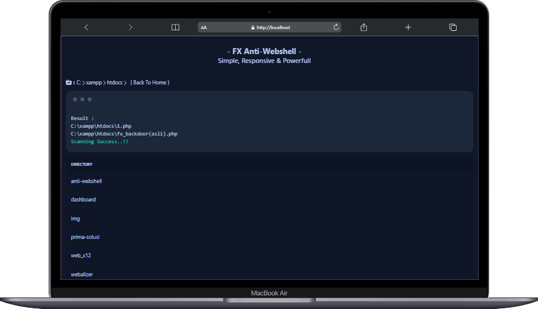

# FX Anti-Webshell
Tools Scanning Backdoor Dari FX(FierzaXploit)

<b>*Mampu mendeteksi semua jenis webshell</b>

<b>- Installing</b>
1. Download Via .Zip
2. Download via wget https://raw.githubusercontent.com/fierzaeriez/FX-Anti-Webshell/main/FX_Anti-Webshell.php -O FX.php

<b>- Usage</b> 
Untuk menggunakan FX Anti-Webshell anda perlu mengupload FX Anti-Webshell kedalam hosting/directory website anda setelah berhasil ter-upload
silahkan akses FX Anti-Webshellnya, EXAMPLE : https://127.0.0.1/NamaFile.php or https://127.0.0.1/PATH/NamaFile.php
  
<b>- View</b> 

| Mobile

| Laptop

